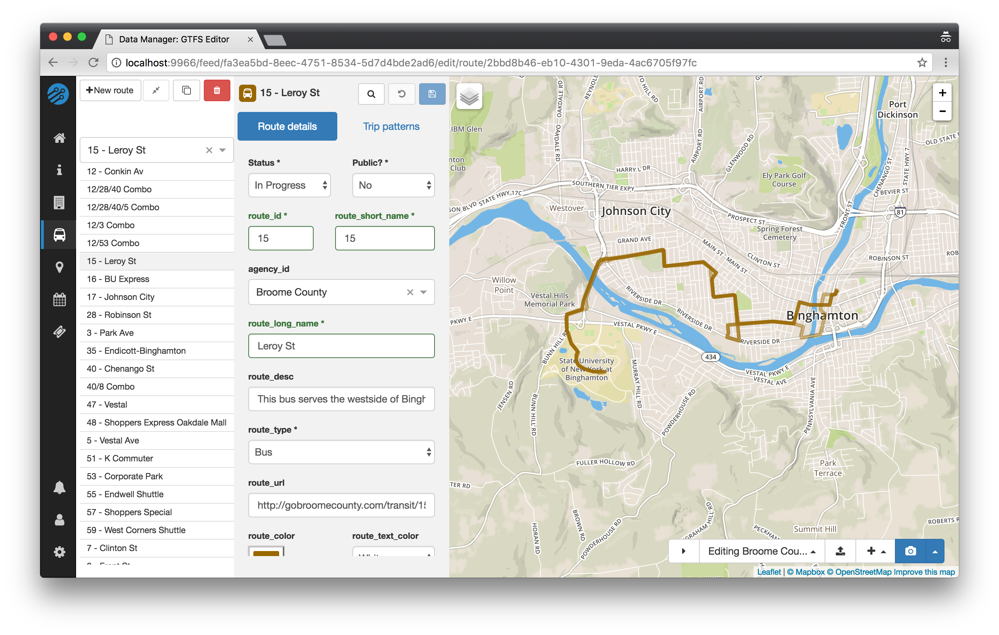

# Routes

## Editing routes

To begin editing routes, click the 🚍 button on the lefthand navigation bar.

Choose a route from the list or search by route name in the dropdown. To create a new route, click `+ New route`. **Note:** as with all newly created items (except patterns), the new route will not be saved until the save icon (💾) is clicked.

## Zoom to route extents
Clicking the 🔍 button (in the top toolbar) with a route selected adjusts the map view to show the entire route (i.e., all patterns) you are editing.

## Route details

Some of the fields to be filled in are required before you can ‘Save and Continue’ and move to the next step, these are:

- **Short name** – name of the service/route, this may just be a number
- **Long name** – the full name of the route, often including the origin and destination
- **Route Type** – the type of vehicle/transport used on the route
Other fields in this section are optional and do not have to be filled in, these are:
- **Description** – a description of the route, do not simply repeat the information in ‘Long name’
- **URL** – a link to a webpage with information on the specific route, such as the timetable
- **Color** – if a route has a color (for use in trip planners etc) it can be assigned here
- **Text color** – if a route has a text color (for use in trip planners etc) it can be assigned here
- **Comments** – any additional information about the route can be placed here

Once all the required fields, and any of the desired optional fields, are filled in click ‘Save and continue’.

## Review

This final page allows you to show if a route has been completely entered, and if it has whether it has been checked and approved for inclusion in the GTFS feed.

### Status

There are three options for **Status**:

- **In-Progress** - showing a route has not been completely entered.
- **Pending Approval** - a route has all the information entered and is awaiting a senior person to sign it off
- **Approved** - all the above stages have been completed.

### Publicly visible

Leave this box unchecked if you are entering a route that is not to be included in a GTFS output, or is in-progress.

## Trip Patterns

Once you've created and saved a route, you can then begin creating trip patterns for the route.

[Learn about editing trip patterns »](patterns)
